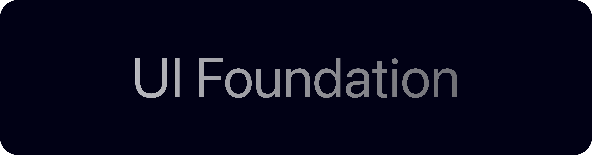

<picture>
  <source media="(prefers-color-scheme: dark)" srcset="Images/KiraUIFoundationBannerDark.png">
  <source media="(prefers-color-scheme: light)" srcset="Images/KiraUIFoundationBannerLight.png">
  
</picture>

# UI Foundation

A modern, declarative UI framework for the Kira programming language. Build beautiful, GPU-accelerated applications with a clean, expressive API — from frosted glass cards to glowing interfaces.

## Features

**Declarative by Design**
Define your entire UI as composable data structures. No templates, no bindings — just clean, readable Kira code.

```kira
RunFoundationApp(
    Card(
        children: [
            VStack {
                spacing: 8.0
                children: [
                    Text(content: "Hello, World!")
                ]
            }
        ]
    )
)
```

**Rich Material System**
Seven distinct materials give your interfaces depth and character:

| Material | Description |
|----------|-------------|
| `Flat` | Clean solid surfaces |
| `Translucent` | Semi-transparent overlays |
| `Frosted` | Beautiful blur-behind glass |
| `LayeredGlass` | Multi-layer glass effect |
| `Luminous` | Soft inner glow |
| `Metallic` | Brushed metal appearance |
| `Crystal` | Prismatic, light-catching surfaces |

**Layered Visual Effects**
Add glow effects that react to your interface:

- **BackdropGlow** — light bleeds through from behind
- **LayerGlow** — glow radiates from the surface itself

```kira
let material: FoundationMaterial = FoundationMaterial.Frosted
let effects: [FoundationEffect] = [
    FoundationEffect.LayerGlow(Glow {
        color: Color { r: 0.3, g: 0.55, b: 1.0, a: 1.0 }
        radius: 18.0
        intensity: 0.45
    })
]
```

**Flexible Layout**
Flexbox-inspired layout system with `VStack` and `HStack` — spacing, padding, alignment, all there.

**Interactive Hit Areas**
Drop-in clickable regions with optional disabled states and press handlers.

**Retained Foundation Tree**
Foundation views lower into a retained tree with stable node IDs, keyed child reconciliation, dirty layout/render flags, state slots, hit target IDs, and deterministic teardown records. The retained layer is intentionally below Kira UI so future `@State`, `@Binding`, environment, styling, and modifier features can attach to stable identity instead of anonymous per-frame values.

## Architecture

Kira UI Foundation sits at the top of a layered rendering pipeline:

```
View (declarative UI)
    │
    ▼
Retained Tree (identity + reconcile + state)
    │
    ▼
Tree (hierarchy + frames)
    │
    ▼
Layout Pass (KiraLayout integration)
    │
    ▼
Layer Tree (render-ready structure)
    │
    ▼
Renderer (graphics commands)
    │
    ▼
Backend (KiraGraphics)
```

## Available Components

| Component | Description |
|-----------|-------------|
| `FoundationView` | Base class for all views |
| `Surface` | Configurable background container |
| `Card` | Pre-styled frosted card with glow |
| `Text` | Styled text rendering |
| `VStack` | Vertical layout container |
| `HStack` | Horizontal layout container |
| `HitArea` | Interactive click region |

## Getting Started

### Prerequisites

- [Kira SDK](https://github.com/kira-lang-com/kira) (v0.1.0)
- [KiraGraphics](https://github.com/kira-lang-com/kira-graphics)
- [KiraLayout](https://github.com/kira-lang-com/kira-layout)

### Setup

1. Clone the repository:
```bash
git clone https://github.com/kira-lang-com/kira-ui-foundation.git
cd kira-ui-foundation
```

2. Update your `kira.toml`:
```toml
[dependencies]
KiraUIFoundation = { path = "path/to/kira-ui-foundation" }
```

### Run the Example

```bash
cd Examples/basic-foundation-app
kira run
```

## Project Structure

```
kira-ui-foundation/
├── app/
│   ├── App/           # Application entry point
│   ├── Backend/       # Graphics backend integration
│   ├── Core/          # Paint, materials, effects
│   ├── Layers/        # Layer tree and building
│   ├── Layout/        # Layout pass integration
│   ├── Renderer/       # Layer → graphics renderer
│   ├── Tree/          # View tree builder
│   └── Views/         # UI components
└── Examples/
    ├── basic-foundation-app/
    └── SimpleApp/
```

## Ecosystem

Kira UI Foundation is part of the Kira language ecosystem:

- [Kira](https://github.com/kira-lang-com/kira) — the language compiler & VM
- [KiraGraphics](https://github.com/kira-lang-com/kira-graphics) — GPU graphics backend
- [KiraLayout](https://github.com/kira-lang-com/kira-layout) — flexbox layout engine
- [Foundation](https://github.com/kira-lang-com/foundation) — core utilities

## License

Apache 2.0 — see [LICENSE](LICENSE)
